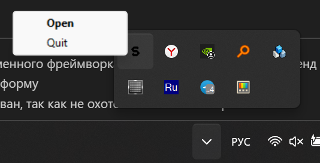

# SmartKeyboard

## Описание
Это проект умной клавиатуры.
## Принцип работы
- Запускаем приложение, при этом запускается фоновый процесс
- Задаем скрипты
    - Имя (для удобства)
    - Команда для запуска скрипта (команда powershell)
    - Кнопка (сигнал, посылаемый с Arduino, для удобства сигналы кнопок соотвествуют пинам, к которым подключены; сигналы энкодера: 1001 для считывания поворота налево, 1002 для считывания поворота направо, 1003 для единичного нажатия на энкодер, 1004 для долгого нажатия на энкодер, 1005 для считывания поворота налево при нажатии, 1006 для считывания поворота направо при нажатии, 1007 для двойного нажатия)
    - Для удаления скрипта используется кнопка "—" в правом верхнем углу карточек скриптов
    - Для добавления нового скрипта используется кнопка "+" внизу списка скриптов
- Все! Можем закрывать. Более ничего не нужно, остается только использовать. Нажимаем, крутим
- Можете использовать иконку на панели задач для открытия настроек скриптов или для завершения фонового процесса

    

## Организация приложения
В папке приложения на flutter лежит исполнаемый файл фоновой задачи, собранный при помощи pyinstaller, и при открытии приложения на flutter в этой же папке создается текстовый файл scripts.txt, при помощи которого часть на flutter обменивается json-ом скриптов с приложением на python.

При запуске приложения на flutter, запускается фоновая задача. При нажатии "Open" в меню иконки приложения на панели задач, запускается приложение на flutter.
## Репозитории организации
- smart_keyboard_arduino - прошивка Arduino
- smart_keyboard_pc - фронтенд
- smart_keyboard_background_task - фоновая задача
- smart_keyboard_example_scripts - скрипты для примера
## Особенности
- Гарантия отсутсвия выполнения двух фоновых задач одновременно, реализовано при помощи lock-файла
- Клавиатуру можно переподсоединять сколько угодно раз прямо во время выполнения выполнения программы (включая фоновую задачу)
- Использование передового кроссплатформенного фреймворка Flutter, благодаря чему фронтенд можно адаптировать практически под любую платформу
- Автозапуск при старте Windows не реализован, так как не охото потом компьютер чистить.
## Авторы
Мартынов Руслан - схема, прошивка Arduino

Панфилова Анастасия - фронтенд, flutter

Филиппов Александр - пример скрипта, презентация

Орел Арсений - пример скрипта, презентация

Кербер Егор - фоновая задача, python
